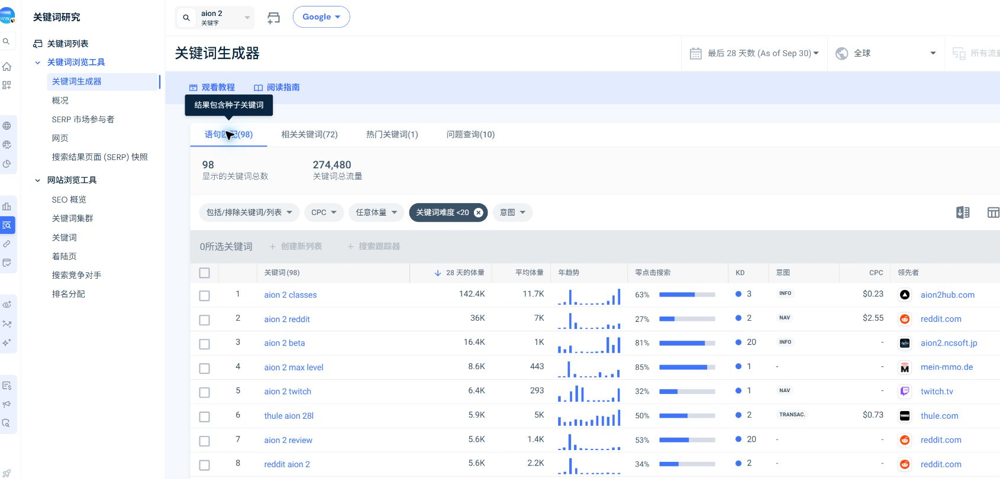

# AION 2 · Similarweb 低 KD 长尾词收集

**筛选复核：** [补充 classes、wings、database、specs；max level 原已入榜](selection-review.md)。原 22 组长尾与 4 个补充低 KD 候选合计 26 组研究候选，下面的 22 组统计保留首次筛选口径。

**收集 26 个英语原始长尾查询，合并为 22 组需求；其中 15 组代表查询 KD ≤10。**

- 采集：2026-10-04，北京时间 10:45–10:47。通过 browser computer-use 实际读取已登录 Similarweb。
- 口径：Worldwide / Google / All traffic / Last 28 days；页面标注 As of Sep 30，即数据截至 2026-09-30。
- 筛选：KD 1–20，无搜索量下限。UI 标签为 <20，但结果中实际包含 KD 20，按读到的值记录。
- 完整读取：语句匹配 98 条、相关词 72 条、问题词 10 条，三表均只有一页；共 180 条观察。热门词表和其他种子不在本次范围。
- 原始查询去重 131 个；其他词及排除原因保留在 selected-keywords.json。
- 精选代表查询中，13 组近期体量 ≥50，9 组显示 <50。
- 搜索量与 KD 均为 Similarweb 工具估计。低 KD 不保证能排名；本轮没有核验真实 Google SERP。
- 本轮只收集数据、人工分组和提出承接方案；游戏机制、菜单、工具兼容等仍须按 Global/KR/TW 补来源。
- 同一答案的词形合并；不同问题可在同页补 FAQ，因此 22 组不等于 22 张新页。

## 先看这 6 组

| 英语关键词 | 最近 28 天体量 | 平均体量 | KD | 零点击 | 处理方式 |
| --- | ---: | ---: | ---: | ---: | --- |
| `aion 2 max level` | 8.6K | 443 | 1 | 85% | 维护已有答案：/leveling#global-leveling |
| `aion 2 dps meter` | 5.1K | 1K | 6 | 88% | 补充已有页：/notmeter |
| `aion 2 global changes` | 1.2K | 140 | 7 | 64% | 候选新页：/global-changes（计划） |
| `aion 2 class change` | 220 | < 50 | 9 | 83% | 补充已有页：/classes（拟补 FAQ） |
| `aion 2 gathering map` | 180 | 96 | 1 | 57% | 维护已有答案：/gathering#gathering-routes；/map |
| `aion 2 talent calculator` | 120 | < 50 | 2 | 86% | 候选工具：/builds；/talent-calculator（计划） |

P1 是本轮调查/维护顺序，不代表都已具备制作证据。Global changes、class change 和 talent calculator 先补事实或数据。

## 全部精选组

| 优先级 | 规范关键词 | 代表原始查询 | 28 天体量 | 平均体量 | KD | 承接/计划 |
| --- | --- | --- | ---: | ---: | ---: | --- |
| P1 | `aion 2 max level` | `aion 2 max level` | 8.6K | 443 | 1 | /leveling#global-leveling |
| P1 | `aion 2 dps meter` | `aion 2 dps meter` | 5.1K | 1K | 6 | /notmeter |
| P1 | `aion 2 global changes` | `aion 2 global changes` | 1.2K | 140 | 7 | /global-changes（计划） |
| P2 | `aion 2 how to play on taiwan server` | `how to play aion 2 on taiwan server` | 890 | 147 | 2 | /download；/taiwan-server-guide（计划） |
| P3 | `aion 2 private server` | `aion 2 private server` | 2.1K | 651 | 19 | /private-server（计划） |
| P2 | `aion 2 global server` | `aion2 global server` | 640 | 329 | 20 | /server |
| P2 | `aion 2 console release` | `aion 2 console release` | 460 | 53 | 20 | /steam#platform-and-controller-support |
| P2 | `aion 2 how to play` | `aion 2 how to play` | 420 | 744 | 13 | /guide；/download |
| P2 | `aion 2 new class` | `aion 2 new class` | 390 | 162 | 9 | /classes#brawler-and-regional-guides |
| P2 | `aion 2 eu release date` | `aion2 eu release date` | 340 | 129 | 6 | /steam#access-schedule |
| P1 | `aion 2 class change` | `aion 2 class change` | 220 | < 50 | 9 | /classes（拟补 FAQ） |
| P1 | `aion 2 gathering map` | `aion 2 gathering map` | 180 | 96 | 1 | /gathering#gathering-routes；/map |
| P1 | `aion 2 talent calculator` | `aion 2 talent calculator` | 120 | < 50 | 2 | /builds；/talent-calculator（计划） |
| P2 | `aion 2 what does quna do` | `aion 2 what does quna do` | < 50 | 186 | 9 | /monetization#currency-and-trading |
| P2 | `aion 2 how many players per server` | `how many players has an aion 2 server` | < 50 | 65 | 9 | /server（拟补 FAQ） |
| P2 | `aion 2 eu server location` | `aion 2 eu server location` | < 50 | 62 | 13 | /server（拟补 FAQ） |
| P3 | `aion 2 raid 2026` | `aion 2 raid 2026` | < 50 | 58 | 9 | /raid-guide（计划） |
| P2 | `aion 2 taiwan discord` | `aion 2 taiwan discord` | < 50 | 78 | 6 | /guide#community-resources |
| P3 | `aion 2 fishing release` | `aion2 fishing release` | < 50 | 56 | 20 | /fishing（计划） |
| P3 | `aion 2 are maps connected to aion 1` | `are aion 2 maps connected to aion 1` | < 50 | 57 | 13 | /map（拟补 FAQ） |
| P3 | `aion 2 can i use vpn and connect to japan to play` | `can i use vpn and connect to japan to play aion 2?` | < 50 | 114 | 1 | /download（拟补 FAQ） |
| P2 | `aion 2 how much do i have to p2w in global release` | `how much do i have to p2w in aion 2 global release` | < 50 | 76 | 2 | /monetization |

## 同义词指标不能互相替换

| 规范组 | 实际读取原词 | 28 天体量 | 平均体量 | KD |
| --- | --- | ---: | ---: | ---: |
| `aion 2 global changes` | `aion 2 global changes` | 1.2K | 140 | 7 |
| `aion 2 global changes` | `aion 2 global change` | < 50 | 62 | 8 |
| `aion 2 how to play` | `aion 2 how to play` | 420 | 744 | 13 |
| `aion 2 how to play` | `how to play aion2` | < 50 | 540 | 6 |
| `aion 2 how to play` | `how to play aion 2` | < 50 | 1.5K | 6 |
| `aion 2 how to play` | `aion 2 how tp play` | < 50 | 61 | 13 |

例如 `aion 2 how to play` 为 420 / KD13，而 `how to play aion 2` 为 <50 / KD6；不能组合成 420 / KD6。

## 每组内容缺口

- **aion 2 max level**：已有 Global/KR/TW 等级上限说明；优化关键词入口，更新时复核官方版本。
- **aion 2 dps meter**：已有 NotMeter 安装与 DPS 说明；可加强通用 DPS meter 意图和 Global 兼容说明。
- **aion 2 global changes**：独立整理 Global 与 KR/TW 差异；逐项补地区、版本与官方证据。
- **aion 2 how to play on taiwan server**：已有地区入口说明；完整 TW 注册、客户端、语言、地区限制步骤仍需核验。
- **aion 2 private server**：需求存在；须核实是否为 AION 2，避免混入 AION 1 私服和未证实服务。
- **aion 2 global server**：已有 Global 大区和服务器；继续区分 TW/KR 与 Global 服务。
- **aion 2 console release**：核实主机发行公告；缺少公告不能写成永久不支持。
- **aion 2 how to play**：统一入门与安装意图；不同原始问法的搜索量和 KD 分别保留，不相加。
- **aion 2 new class**：已有 Brawler 地区区别；Global 新职业开放状态待官方更新。
- **aion 2 eu release date**：已有 Global 开放时间；按欧洲时区和当前阶段核对。
- **aion 2 class change**：现有职业页没有完整转职答案；先核实是否支持、操作与限制，不推断机制。
- **aion 2 gathering map**：已有地图筛选与采集路线；可增强资源筛选示例和入口。
- **aion 2 talent calculator**：需核对 Global 天赋数据、节点与点数规则；不能把现有角色查询工具算作天赋计算器。
- **aion 2 what does quna do**：已有 Quna 用途与兑换说明；当前 28 天量低于 50，先做 FAQ。
- **aion 2 how many players per server**：这是单服容量/人数需求；与全游戏并发不同，缺官方容量数字时不编造。
- **aion 2 eu server location**：需要欧洲服务器物理部署地点证据；不能从大区名称推出机房城市。
- **aion 2 raid 2026**：需要确认指向哪一地区、版本、团本与入口；低量宽泛词先观察。
- **aion 2 taiwan discord**：以地区社区导航满足需求；核验邀请链接与官方/社区身份。
- **aion 2 fishing release**：需要确认真实机制、地区和开放公告；本轮工具词不能证明钓鱼已经开放。
- **aion 2 are maps connected to aion 1**：核实两代地图/世界关系和区域名称；先按简短 FAQ 处理。
- **aion 2 can i use vpn and connect to japan to play**：核实服务地区、账号与平台限制；不把 VPN 当作已实测可用结论。
- **aion 2 how much do i have to p2w in global release**：已有商业模式；不能仅凭需求给付费强度或最小花费数字，需实际 Global 依据。

## 保存文件

- [原始 UI 观察](observations.json)：180 条，保留词形、指标、来源 URL、采集时间。
- [人工精选与排除记录](selected-keywords.json)：22 组、原词变体、页面映射、优先级和缺口。
- [可筛选 CSV](long-tail.csv)：每个原词单独一行，供后续排序。

原 63 词库与 28 个发布主题保持当前记录；新增查询作为本次研究候选保存。后续只有在确认内容价值及事实证据后才决定更新或新增页面。

Similarweb 的 Excel 导出弹出套餐升级提示；本次 CSV 由已读取的页面表格数据整理，原始观察和操作限制见 [采集日志](browser-log.md)。

来源页面：[Similarweb 语句匹配](https://pro.similarweb.com/#/digitalsuite/acquisition/findkeywords/keyword-generator-tool/999/28d?searchEngine=google&keyword=aion%202&webSource=Total&isWWW=*&tab=phraseMatch&difficultyFromValue=1&difficultyToValue=20&multiIncludeExcludeKeywords=%5B%5D)。
